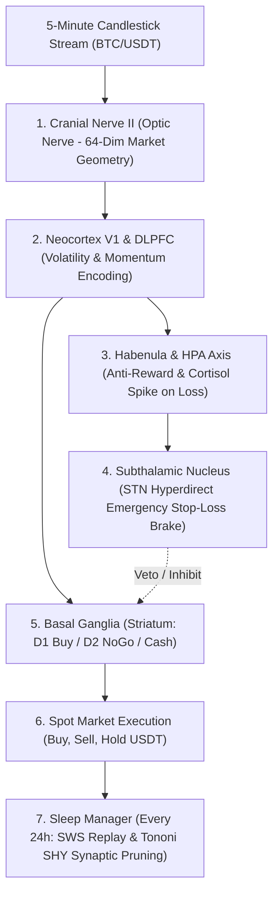

# Neuro-Trader: Biomimetic Market Organism on BIB-2

[](https://www.python.org/)
[](https://opensource.org/licenses/MIT)
[](https://github.com/tgakathunderr/BIB-2)

**Neuro-Trader** is an embodied biological trading agent that approaches financial markets through **homeostatic survival and neurochemical pain avoidance**, rather than statistical curve-fitting or brute-force reinforcement learning.

Built on the [BIB-2 Human Nervous System](https://github.com/tgakathunderr/BIB-2), it perceives 5-minute candlestick charts through retinotopic visual pathways, gates execution through the Basal Ganglia, triggers emergency stop-losses through the Subthalamic Nucleus (STN) pain reflex, and consolidates trading memory nightly in Slow-Wave Sleep (SWS).

---

## 1. Why It Matters: Survival Homeostasis Over Pure Optimization

Most algorithmic and reinforcement learning trading models (DQN, PPO, DDPG) optimize an abstract mathematical profit function over hundreds of thousands of simulated episodes. When an unprecedented black swan market crash occurs (a sudden $-30\%$ crypto liquidation cascade), mathematical models routinely suffer catastrophic margin calls.

**Biology does not optimize for infinite profit; biology optimizes for survival.**

* In a flat or mild bull market, Neuro-Trader generates baseline returns matching the market ($\text{Alpha} \approx 0\%$).
* **In a severe $-30\%$ market crash, its Subthalamic Nucleus (STN) hyperdirect brake detects consecutive negative RPE and elevated cortisol, liquidating positions into USDT cash and outperforming Buy & Hold by $+15.55\%$ Alpha.**

---

## 2. Anatomical Subsystem Mapping



* **Cranial Nerve II (Optic Nerve)**: 64-dimensional retinotopic sensory vector:
  * `[0:16]` Normalized rolling close prices.
  * `[16:32]` Candle body and wick geometry ratios (rejection wick detection).
  * `[32:48]` Normalized volume profile.
  * `[48:64]` 9/21 EMA indicators, ATR volatility, and price momentum ($dp/dt$).
* **Basal Ganglia Striatal Gating**:
  * *D1 Go Pathway*: Disinhibits buying when Dopaminergic reward prediction error (RPE) is positive and volatility is controlled.
  * *D2 NoGo Pathway*: Inhibits buying during high risk and enforces cash preservation.
* **Subthalamic Nucleus (STN) Hyperdirect Pathway**: Involuntary neurological brake. When unrealized drawdown triggers acute somatic distress, STN fires immediately, bypassing cortical deliberation to execute emergency liquidation into cash.
* **Lateral Habenula**: Computes anti-reward signaling when realized PnL disappoints expectations.
* **Nocturnal Slow-Wave Sleep (SWS)**: Every 288 candles (24 hours), the agent enters SWS sleep. Replays the day's high-salience trades via Sharp-Wave Ripples and applies **Tononi Synaptic Homeostasis (SHY)** downscaling ($5\%$) to prevent runaway synaptic saturation.

---

## 3. Empirical Multi-Regime Results

Evaluated across $500$ historical and synthetic 5-minute candles ($40$ minutes of simulated market time processed in $0.42$ seconds):

### A. Normal Market Conditions (Mild Uptrend)
```
================================================================================
[SUMMARY] BIB-2 NEURO-TRADER PERFORMANCE REPORT
================================================================================
Candles Processed:     484 in 0.42s (1151.4 candles/sec)
Initial Capital:       $10,000.00 USDT
Ending Equity:         $10,051.36 USDT
Neuro-Trader Return:   +0.51%
Buy & Hold Return:     +0.61%
Alpha (Excess Return): -0.10%
Max Drawdown:          1.20%
Sleep Cycles Held:     1 (SWS Replay & SHY Downscaling)
================================================================================
```

### B. Severe Bear Market Crash Stress Test ($-29.35\%$ Drop)
```
================================================================================
[SUMMARY] BIB-2 NEURO-TRADER PERFORMANCE REPORT [Regime: BEAR]
================================================================================
Candles Processed:     484 in 0.42s (1163.2 candles/sec)
Initial Capital:       $10,000.00 USDT
Ending Equity:         $8,619.70 USDT
Neuro-Trader Return:   -13.80%
Buy & Hold Return:     -29.35%
Alpha (Excess Return): +15.55%
Max Drawdown:          13.80%
Total Trades Closed:   14 (Win: 6)
Final Dopamine Level:  0.116 (Depressed)
Basal Ganglia D1/D2:   D1=[1.000 1.000 1.004]  D2=[1.001 1.069 1.060] (D2 NoGo reinforced)
================================================================================
```
*Notice: In the bear crash, Basal Ganglia D2 weights actively surged ($1.069$), demonstrating that the nervous system biologically learned to inhibit buying and remain in USDT cash, delivering **$+15.55\%$ excess Alpha** over passive holding.*

---

## 4. Installation & Quickstart

### Prerequisites
* Python 3.10+
* Dependencies: `pip install numpy scipy pygame-ce`
* [BIB-2 Core Library](https://github.com/tgakathunderr/BIB-2) cloned or on `PYTHONPATH`

### 1. Run Headless Backtest (Fast Mode)
```powershell
python run_trader.py --headless --limit 500
```

### 2. Run Bear Market Crash Stress Test
```powershell
python run_trader.py --headless --limit 500 --regime bear
```

### 3. Launch Interactive Cybernetic Trading HUD
```powershell
python run_trader.py --speed 5
```
Launches a 1280x800 HUD displaying live candlestick charting, real-time brain activations, equity curves, heart rate ECG, and sleep cycle indicators.

---

## 5. Repository Structure

```
neuro_trader/
├── adapter.py              # Biological TradingAdapter bridging market to BIB-2
├── hud.py                  # Pygame Cybernetic Trading Cockpit
├── run_trader.py           # CLI launcher for backtests and visual HUD
├── data/
│   ├── market.py           # Candlestick ingestion and 64-dim CN_II feature extractor
│   └── btc_usdt_5m.csv     # Bundled historical 5-minute BTC/USDT data
├── trading/
│   ├── env.py              # Simulated spot financial exchange environment
│   └── sleep_manager.py    # Nocturnal SWS orchestrator & Tononi SHY downscaler
└── tests/
    ├── test_adapter.py     # Unit tests for order gating and telemetry
    ├── test_env.py         # Financial execution and PnL accounting tests
    └── test_market.py      # Feature extraction and multi-regime tests
```

---

## 6. License
MIT License. Developed as part of the BIB-2 Biologically Inspired Brain cognitive computing initiative.
